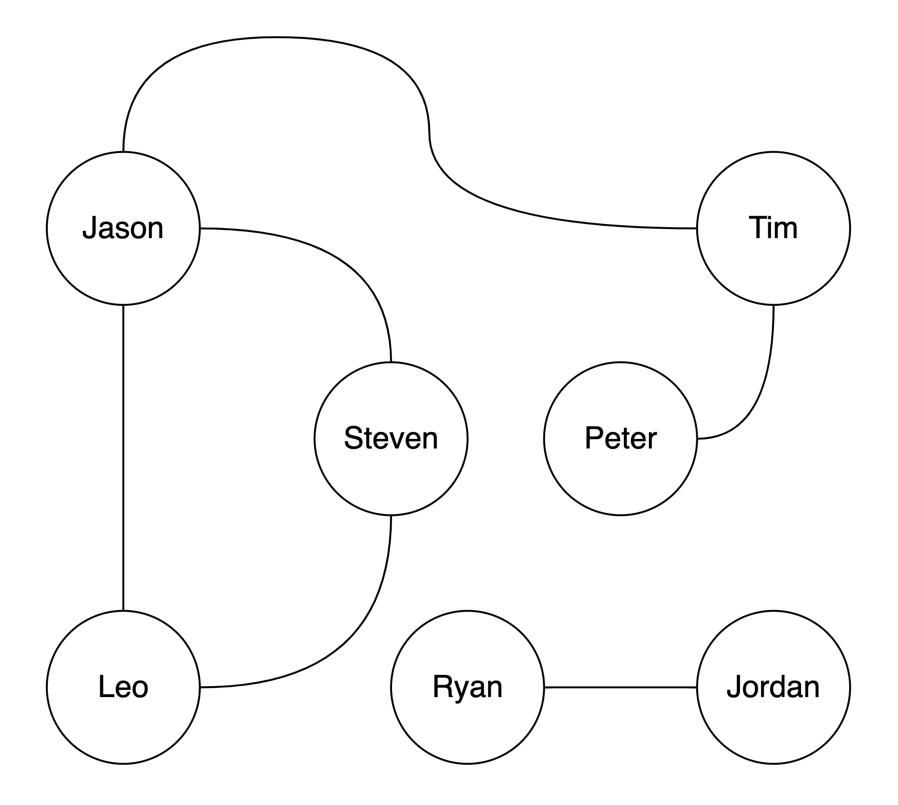

# State-based Last-Write-Win-Element Graph

## About

In this project, it implemented the data structure of Last-Write-Wins-Element Graph(lww-graph) in JavaScript. In terms of lww-graph, it is the State-based [Conflict-Free Replicated Date Type](https://en.wikipedia.org/wiki/Conflict-free_replicated_data_type)(CRDT) to provide an eventual consistency data to each replicas.

## Features

- Add or remove vertex
- Add or remove edge
- Check if a vertex is in the graph
- Query for all vertices connected to a vertex
- Find all possible paths between two vertices
- Merge with concurrent changes from other graph or replica
  - The merge function is commutative, associative and idempotent

## Setup

This project is created with **Node.js version: 12.22.1**

### Install node modules for testing

```bash
$ npm install
```

### Run `index.js`

```bash
$ node index.js
```

After run the `index.js`, you should see the result below.

```bash
Replica1 - searchVertex(Jason): 3 vertices found
Tim,Steven,Leo

Replica2 - searchVertex(Jason): 3 vertices found
Tim,Steven,Leo

Replica3 - searchVertex(Jason): 3 vertices found
Tim,Steven,Leo

Replica1 - findAllReachableVertices(Jason): 4 vertices found
Tim,Steven,Leo,Peter

Replica2 - findAllReachableVertices(Jason): 4 vertices found
Tim,Steven,Leo,Peter

Replica3 - findAllReachableVertices(Jason): 4 vertices found
Tim,Steven,Leo,Peter

Replica1 - findAllPaths(Peter, Leo): 2 paths found
Peter -> Tim -> Jason -> Leo
Peter -> Tim -> Jason -> Steven -> Leo
Replica2 - findAllPaths(Peter, Leo): 2 paths found
Peter -> Tim -> Jason -> Leo
Peter -> Tim -> Jason -> Steven -> Leo
Replica3 - findAllPaths(Peter, Leo): 2 paths found
Peter -> Tim -> Jason -> Leo
Peter -> Tim -> Jason -> Steven -> Leo
```

## Usage

### Class: Graph

#### Constructor

```javascript
new Graph();
```

#### Method: `searchVertex(vertex)`: Array

Return an array which contains all direct connected vertices

| Parameter | Type                    | Required | Default |
| --------- | ----------------------- | -------- | ------- |
| vertex    | String, Number, Boolean | `true`   |         |

#### Method: `findAllReachableVertices(vertex)`: Array

Return an array which contains all reachable vertices

| Parameter | Type                    | Required | Default |
| --------- | ----------------------- | -------- | ------- |
| vertex    | String, Number, Boolean | `true`   |         |

Throw an error when `vertex` are not exist in the graph

#### Method: `findAllPaths(from, to, visited = [], allPaths = [])`: Array

Return an array which contains all possible paths

| Parameter | Type                    | Required | Default |
| --------- | ----------------------- | -------- | ------- |
| from      | String, Number, Boolean | `true`   |         |
| to        | String, Number, Boolean | `true`   |         |
| visited   | Array                   | `false`  | `[]`    |
| allPaths  | Array                   | `false`  | `[]`    |

Throw an error when `from` or `to` vertex is not exist in the graph

### Class: StateBasedLwwElementGraph

#### Property: `graph`: Graph

The `graph` will return a `Graph` object with the existing vertices and edges

#### Constructor

```javascript
new StateBasedLwwElementGraph();
```

#### Method: `addVertex(vertex, timestamp = Date.now())`: void

Add a `SetElement` into `verticesSet` with provided vertex

| Parameter | Type                    | Required | Default      |
| --------- | ----------------------- | -------- | ------------ |
| vertex    | String, Number, Boolean | `true`   |              |
| timestamp | Number                  | `false`  | `Date.now()` |

#### Method: `removeVertex(vertex, timestamp = Date.now())`: void

Remove a `SetElement` of provided vertex from `verticesSet`

| Parameter | Type                    | Required | Default      |
| --------- | ----------------------- | -------- | ------------ |
| vertex    | String, Number, Boolean | `true`   |              |
| timestamp | Number                  | `false`  | `Date.now()` |

Throw an error when `vertex` is not exist in the `verticesSet`

#### Method: `addEdge(from, to, timestamp = Date.now())`: void

Add an edge into `edgesSet` with provided vertices

| Parameter | Type                    | Required | Default      |
| --------- | ----------------------- | -------- | ------------ |
| from      | String, Number, Boolean | `true`   |              |
| to        | String, Number, Boolean | `true`   |              |
| timestamp | Number                  | `false`  | `Date.now()` |

Throw an error when `from` or `to` vertex is not exist in the `verticesSet`

#### Method: `removeEdge(from, to, timestamp = Date.now())`: void

Remove an edge of provided vertices from `edgesSet`

| Parameter | Type                    | Required | Default      |
| --------- | ----------------------- | -------- | ------------ |
| from      | String, Number, Boolean | `true`   |              |
| to        | String, Number, Boolean | `true`   |              |
| timestamp | Number                  | `false`  | `Date.now()` |

Throw an error when `from` to `to` edge is not exist in the `edgesSet`

#### Method: `merge(incomingStateBasedLwwElementGraph)`: void

Merge the `verticesSet` and `edgesSet` of `incomingStateBasedLwwElementGraph` into self `verticesSet` and `edgesSet`

| Parameter                         | Type                      | Required | Default |
| --------------------------------- | ------------------------- | -------- | ------- |
| incomingStateBasedLwwElementGraph | StateBasedLwwElementGraph | `true`   |         |

Throw an error when the type of `incomingStateBasedLwwElementGraph` is not `StateBasedLwwElementGraph`

## Example

In this example, it will shows the usage of the APIs above. Also, it demonstrates the features of the lww-graph with 3 different replicas. You will see:

- Add and remove vertex on the same replica
- Add vertex on a replica and remove that vertex on another replica
- Add the same vertex back after some replica deleted
- Add and remove edge on the same replica
- Add edge on a replica and remove that vertex on another replica
- Add the same edge back after some replica deleted
- Merge other replicas to self-replica
- The results of `searchVertex`, `findAllReachableVertices` and `findAllPaths` should be the same on all replicas

The following image to show the relation of each vertices in this example.



```javascript
import StateBasedLwwElementGraph from './lib/stateBasedLwwElementGraph.js';

const replica1 = new StateBasedLwwElementGraph();
const replica2 = new StateBasedLwwElementGraph();
const replica3 = new StateBasedLwwElementGraph();

let t = 1;

// At timestamp: 1
replica1.addVertex('Jason', t);
replica1.addVertex('Hayley', t);

replica2.addVertex('Leo', t);

replica3.addVertex('Jordan', t);

replica1.merge(replica2);
replica2.merge(replica1);

// At timestamp: 2
t = 2;
replica1.addVertex('Steven', t);
replica1.addEdge('Jason', 'Hayley', t);
replica1.addEdge('Leo', 'Steven', t);

replica2.addVertex('Tim', t);
replica2.addEdge('Jason', 'Tim', t);

replica3.addVertex('Peter', t);
replica3.addVertex('Ryan', t);
replica3.removeVertex('Jordan', t);

replica1.merge(replica2);
replica1.merge(replica3);
replica2.merge(replica1);
replica3.merge(replica1);

// At timestamp: 3
t = 3;
replica1.addEdge('Jason', 'Steven', t);
replica1.removeEdge('Jason', 'Hayley', t);

replica2.addVertex('Jordan', t);
replica2.removeVertex('Hayley', t);
replica2.removeEdge('Leo', 'Steven', t);

replica3.addEdge('Tim', 'Peter', t);

replica1.merge(replica2);
replica1.merge(replica3);
replica2.merge(replica1);
replica3.merge(replica1);

// At timestamp: 4
t = 4;
replica1.addEdge('Jason', 'Leo', t);
replica1.addEdge('Jason', 'Tim', t);

replica3.addEdge('Leo', 'Steven', t);
replica3.addEdge('Ryan', 'Jordan', t);

replica1.merge(replica2);
replica1.merge(replica3);
replica2.merge(replica1);
replica3.merge(replica1);

const vertex = 'Jason';
let result;

// Run graph.searchVertex for each replicas
result = replica1.graph.searchVertex(vertex); // Tim,Steven,Leo
console.log(`Replica1 - searchVertex(${vertex}): ${result.length} vertices found\n${result}\n`);

result = replica2.graph.searchVertex(vertex); // Tim,Steven,Leo
console.log(`Replica2 - searchVertex(${vertex}): ${result.length} vertices found\n${result}\n`);

result = replica3.graph.searchVertex(vertex); // Tim,Steven,Leo
console.log(`Replica3 - searchVertex(${vertex}): ${result.length} vertices found\n${result}\n`);

// Run graph.findAllReachableVertices for each replicas
result = replica1.graph.findAllReachableVertices(vertex); // Tim,Steven,Leo,Peter
console.log(
  `Replica1 - findAllReachableVertices(${vertex}): ${result.length} vertices found\n${result}\n`
);

result = replica2.graph.findAllReachableVertices(vertex); // Tim,Steven,Leo,Peter
console.log(
  `Replica2 - findAllReachableVertices(${vertex}): ${result.length} vertices found\n${result}\n`
);

result = replica3.graph.findAllReachableVertices(vertex); // Tim,Steven,Leo,Peter
console.log(
  `Replica3 - findAllReachableVertices(${vertex}): ${result.length} vertices found\n${result}\n`
);

// Run graph.findAllPaths for each replicas
const from = 'Peter';
const to = 'Leo';

result = replica1.graph.findAllPaths(from, to); // [[Peter,Tim,Jason,Leo], [Peter,Tim,Jason,Steven,Leo]]
console.log(`Replica1 - findAllPaths(${from}, ${to}): ${result.length} paths found`);
result.forEach((path) => console.log(path.join(' -> ')));

result = replica2.graph.findAllPaths(from, to); // [[Peter,Tim,Jason,Leo], [Peter,Tim,Jason,Steven,Leo]]
console.log(`Replica2 - findAllPaths(${from}, ${to}): ${result.length} paths found`);
result.forEach((path) => console.log(path.join(' -> ')));

result = replica3.graph.findAllPaths(from, to); // [[Peter,Tim,Jason,Leo], [Peter,Tim,Jason,Steven,Leo]]
console.log(`Replica3 - findAllPaths(${from}, ${to}): ${result.length} paths found`);
result.forEach((path) => console.log(path.join(' -> ')));
```

## Testing

All the data structure files has been completely tested and fully covered(100% coverage).

### Run test

Type `npm run test:coverage` in CLI to run the Jest test and see the coverage report.

```bash
$ npm run test:coverage

> state-based-lww-element-graph@1.0.0 test:coverage
> node --experimental-vm-modules node_modules/.bin/jest --coverage

(node:86279) ExperimentalWarning: VM Modules is an experimental feature. This feature could change at any time
(Use `node --trace-warnings ...` to show where the warning was created)
 PASS  __tests__/lib/stateBasedLwwElementGraph.test.js
 PASS  __tests__/lib/graph.test.js
 PASS  __tests__/lib/lwwTwoPhaseSet.test.js
 PASS  __tests__/crdtGraphUseCase.test.js
------------------------------|---------|----------|---------|---------|-------------------
File                          | % Stmts | % Branch | % Funcs | % Lines | Uncovered Line #s
------------------------------|---------|----------|---------|---------|-------------------
All files                     |     100 |      100 |     100 |     100 |
 graph.js                     |     100 |      100 |     100 |     100 |
 lwwTwoPhaseSet.js            |     100 |      100 |     100 |     100 |
 stateBasedLwwElementGraph.js |     100 |      100 |     100 |     100 |
------------------------------|---------|----------|---------|---------|-------------------

Test Suites: 4 passed, 4 total
Tests:       49 passed, 49 total
Snapshots:   0 total
Time:        0.523 s, estimated 1 s
Ran all test suites.
```

## References

- [Conflict-free replicated data type](https://en.wikipedia.org/wiki/Conflict-free_replicated_data_type)
- [CRDT notes by pfrazee](https://github.com/pfrazee/crdt_notes)
- [A comprehensive study of Convergent and Commutative Replicated Data Types](https://hal.inria.fr/inria-00555588/PDF/techreport.pdf)
